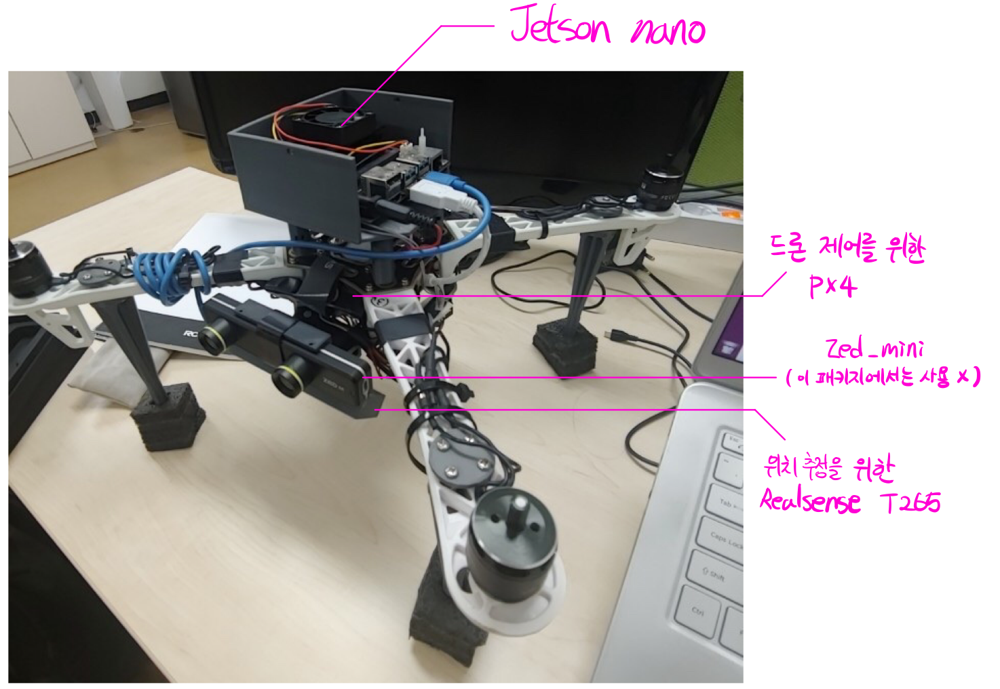
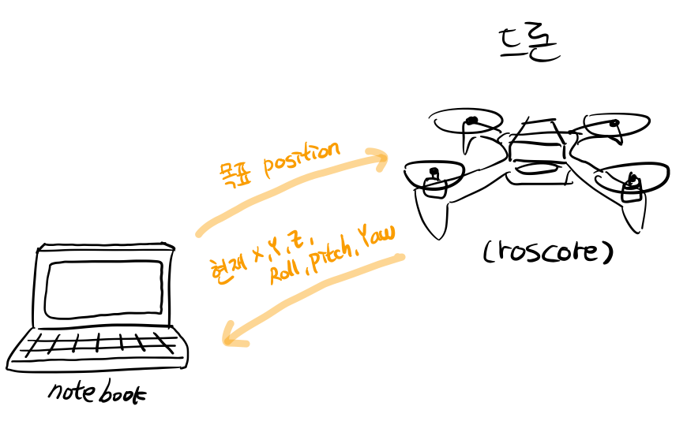
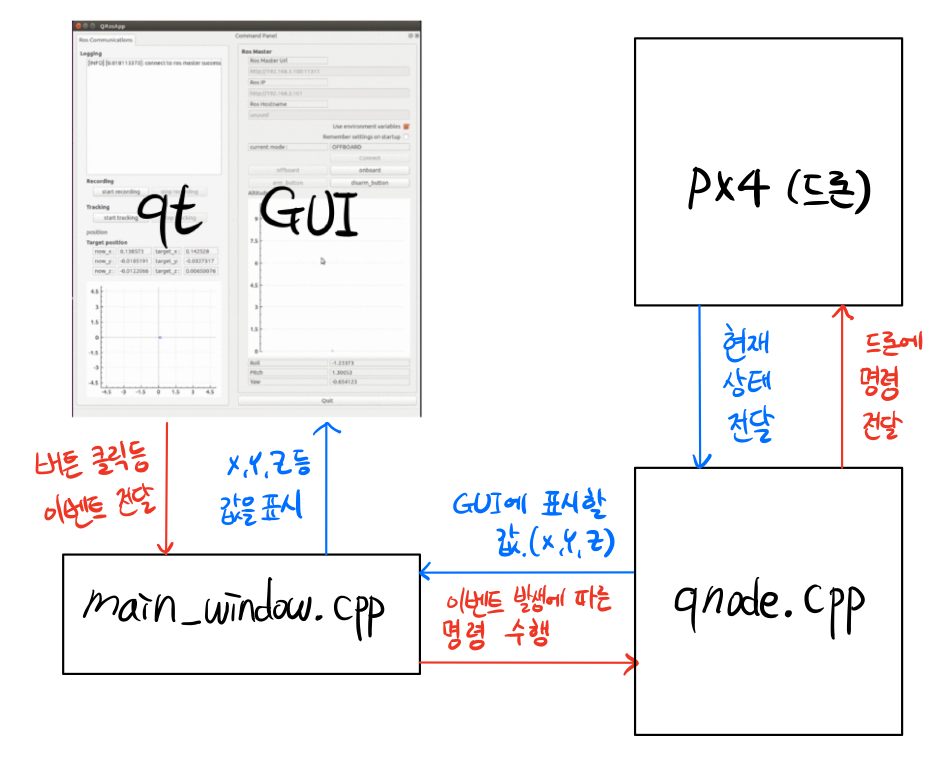

mydrone_gui_keyboard
========================

# 1. summary
드론을 키보드로 조종하거나  
timestamp 마다 position이 기록된 text를 불러들여 드론을 조종합니다.


* IAS lab 학부연구생 과제  
  * 지도교수 : 이현범 교수님  
  * 연수기간 : 2019.08 ~ 2020.09  


* 2020 KRoC
  * '비전센서와 유선 포텐셜 필드를 이용한 쿼드로터의 장애물 회피' 논문에 2저자 참여
  

# 2. Hardware structure



▲ 드론의 구성




▲ 전체 Ros 통신 구성

# 3. Code Structure


## 3-1. 전체 구조



## 3-2. [qnode.cpp](https://github.com/0307kwon/mydrone_gui_keyboard/blob/master/src/qnode.cpp)
### ● 핵심 함수 목록
```c++
void QNode::inputToTextfile() // timestamp마다 드론의 현위치를 txt파일에 기록하는 함수입니다. 

bool QNode::init() // Ros 연결을 정의하여 Ros 통신을 준비합니다.

void QNode::run() // 이 함수에서 지속적인 메세지 수신 or 전달이 이루어집니다.
```

### ● void QNode::run()
1. 드론을 arming(시동을 걺)  ( line 248 ~ 271 )

```c++
if(offboard == true){ // offboard 명령을 받으면//
	TARGETLogging(target_x,target_y,target_z); //target 로깅//
	//offboard 모드가 아니면 지속적으로 offboard 모드 진입 명령을 보냄//
	offb_set_mode.request.custom_mode = "OFFBOARD";
	if( current_state.mode != "OFFBOARD" &&
			(ros::Time::now() - last_request > ros::Duration(5.0))){
		if( set_mode_client.call(offb_set_mode) &&
			offb_set_mode.response.mode_sent){
				log(Info,"Offboard enabled");
		}
		last_request = ros::Time::now();
	}else{ // offboard로 모드가 바뀌면 //
		//arming이나 disarming 수행
		arm_cmd.request.value = arming;
		if(arm_cmd.request.value == true){ // arm 명령을 줄때 //
			if( !current_state.armed &&
			(ros::Time::now() - last_request > ros::Duration(5.0))){
				if( arming_client.call(arm_cmd) && // arming 신호를 보냄//
				arm_cmd.response.success){
					log(Info,"Vehicle armed");
				}
				last_request = ros::Time::now();// 일정시간마다 service 날림//
			}
		}else{ // disarm 명령을 줄 때 //
```
2. 드론에게 목표 position(x,y,z)를 전달  ( line 304 ~ 333 )


* bool_tracking이 true 값이면 txt파일로 읽어들인 x,y,z 목표 위치로 보냅니다.


* bool_tracking이 false 값이면 키보드 명령을 받아 x,y,z 목표 위치로 보냅니다.


```c++
if(offboard == true) {//offboard상태일때만 위치 publish
	if(bool_tracking == true){ // txt를 읽어 궤도를 따라 갈 때//
		if(ros::Time::now()-last_request >ros::Duration(0.1)){
			last_request = ros::Time::now();
			cin >> target_x;
			cin >> target_x >> target_y
			>> target_z;
			double r,p,y;
			cin >> r >> p >> y;
			tf2::Quaternion q;
			q.setRPY(r,p,y);
			targetO_x = q[0];
			targetO_y = q[1];
			targetO_z = q[2];
			targetO_w = q[3];
			//나머지 버리기
			string t;
			getline(cin,t);
		}
	}
	pose.pose.position.x = target_x;
	pose.pose.position.y = target_y;
	pose.pose.position.z = target_z;

	pose.pose.orientation.x = targetO_x;
	pose.pose.orientation.y = targetO_y;
	pose.pose.orientation.z = targetO_z;
	pose.pose.orientation.w = targetO_w;
	local_pos_pub.publish(pose);
}
```


# 4. how to use
1. catkin_ws/src 폴더로 진입
2. git clone https://github.com/0307kwon/mydrone_gui_keyboard.git
3. catkin_make
4. roslaunch mydrone_gui_keyboard mydrone.launch
(tracking 관련 txt파일 위치는 launch파일에서 수정가능)

## 4-1 키보드 사용법
w : 전진  
s : 후진  
a : 좌로 이동  
d : 우로 이동  


↑ : 고도 상승  
↓ : 고도 하강  
( 키입력이 제대로 작동하지 않을 때에는 화면의 오른쪽 Command Panel에 focus를 두고(마우스 클릭) 다시 시도 )  


## 4-2 tracking 사용법
 txt 파일에 저장된 position을 0.1s 마다 한줄씩 읽어 해당 위치로 가도록 명령합니다.

* txt파일 read/write 경로 수정 방법
  * src/mydrone_gui_keyboard/launch/mydrone.launch의 txt_location 값을 수정해줌으로써 변경가능합니다.

* start recording 
  * txt_location 위치에 txt파일로 0.1s 마다 위치와 방향 등을 기록합니다.

* start tracking
  * txt_location 위치의 txt파일을 0.1s 마다 한줄씩 읽어와 드론에게 위치를 전송합니다.
  
  


